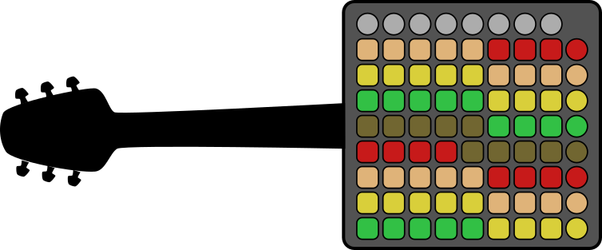
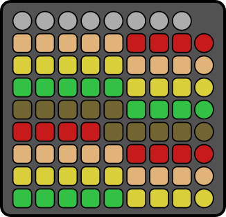

# Launchpad Guitar

## Intro

This package is designed to play a Novation Launchpad in a guitar-like fashion.  It consists of two MIDI routers.  The
first, a "ui router" (see below) creates the user interface by feeding back note information to the Launchpad.  The
second, a "remapping router" (see below) maps the notes used by the launchpad to an arrangement closer to the standard
tuning of a guitar.

## Requirements

1. A browser that supports the WebMIDI API (Chrome and Opera at time of writing).
2. This package.
3. This package's dependencies, which you can install using a command like `npm install`.
4. A Novation Launchpad, configured to use the X-Y note layout (this package is only tested with the original Launchpad,
   and not a MK2).
5. Something that actually plays sounds, that can receive MIDI messages, and which shows up as a MIDI instrument.  For
   example, this package has been tested with Mainstage, Fluidsynth, and with a JV-1010 connected using a Roland UM-ONE.

## Usage Instructions.

Once you have all the requirements:

1. Open the `index.html` file in this directory using your browser.
2. Connect the "ui router" to your launchpad as both the input and output.
3. Connect the "remapping router" to your launchpad as the input, and to your desired output.

## The "UI Router"

The UI presented by this package looks roughly as follows.

Each of the bottom six rows (including right hand circular buttons) corresponds to a string on a standard tuned guitar.
The first note in each row is the "open" tuning of that "string".  The second note is what would be the first fret on
that string.  So, the bottom row is the low E string.  The first note plays E2.  The second note plays F2.

The colour-coding used by this package highlights the unique note ranges.  So, since the strings on a guitar are offset
by five notes, the sixth through ninth notes of the first row share a color with the first five notes of the next
highest row.

The "ui router" also changes the display when you play notes.  When you depress a note on any string, the note's colour
will be cleared.  When you release that note, its colour will return.

The two rows at the top of the unit are not found on a guitar, but continue the same progression from string to string.
The seventh string that begins at A4 and the eighth that begins at D5.

## The "Remapping Router"

The X-Y layout of the Novation Launchpad is designed to play a huge range of notes.  Each row is 15 steps higher than
the one below it.  As there are only 9 notes per row, 5 notes are unplayable.  The remapping router remaps the notes
sent by the launchpad so that each row is 5 steps higher than the one below it.  As a result, all notes in the range are
playable, and the overall range is reduced by the overlap between strings.  The launchpad is also tuned from a very high
E7 to a very low G minus 2.  A guitar is tuned from low to high, and its range is from E2 to E5.  The remapping router
remaps notes so that the "strings" are arranged from low to high, and so that the range of its first six strings is from
E2 to C5.  The range continues up to A5 if you use the seventh and eight rows beyond the traditional guitar strings.

The net effect is intended to be as though you were holding the neck of a guitar with your left hand and looking down at
it.  The lowest string is closest to you, and the highest string is furthest.  The method of playing is different, and
the range on each string is reduced, but you can still use chords and tablature written for a guitar more easily than
with a piano-like instrument.

## Demo Video

You can see [a demonstration of the first version of the Launchpad Guitar on YouTube](https://www.youtube.com/watch?v=OHrn9nKGp8Y).

## Credits

This software is written in Javascript using [Flocking](http://flockingjs.org).
